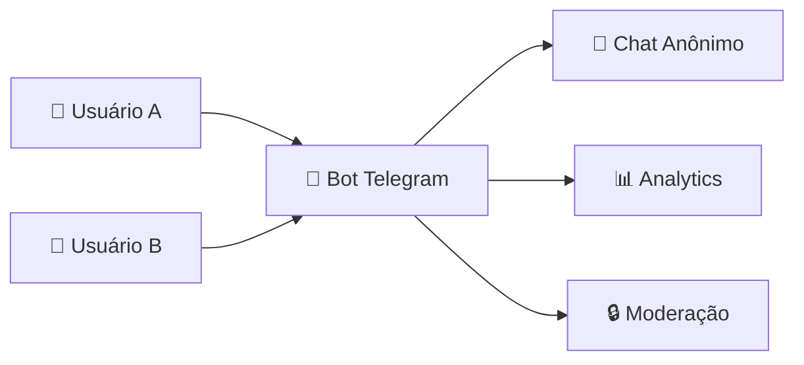
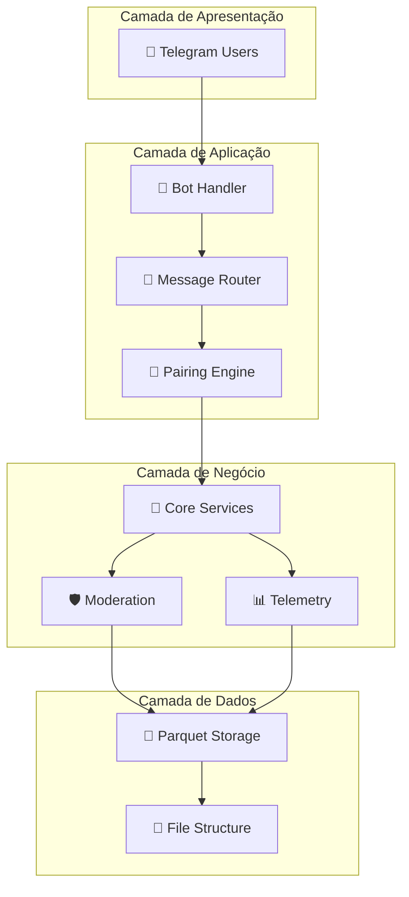
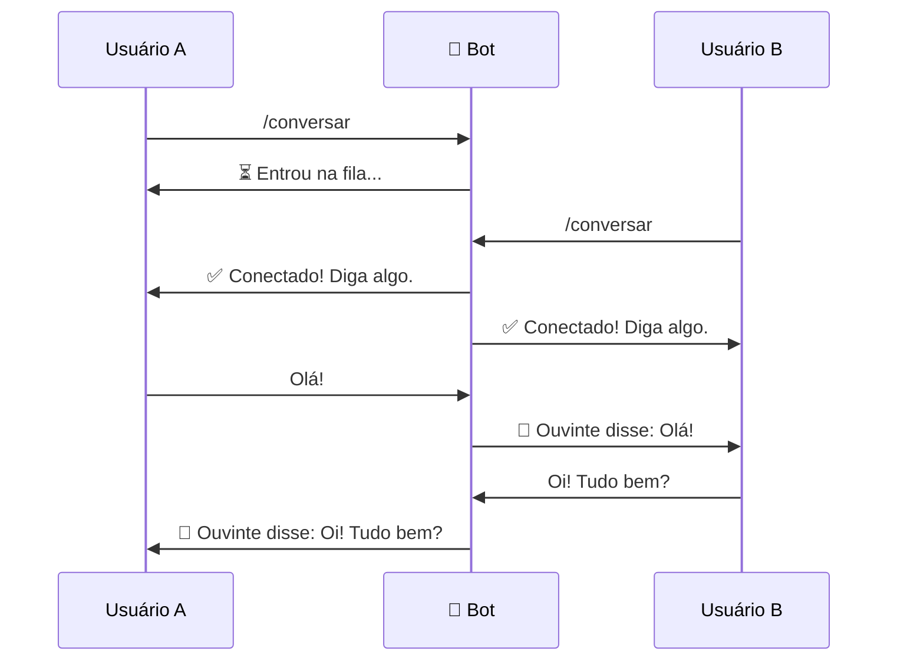

# 🤖 Random Chat Bot V2 - Chat Anônimo para Telegram

<div align="center">


**Conecte pessoas anonimamente com um sistema eficiente e seguro**

[Características](#-características) • [Instalação](#-instalação) • [Como Usar](#-como-usar) • [Administração](#-administração)

</div>

## 🎯 Sobre o Projeto

<div align="center">



</div>

Um bot de chat aleatório e anônimo para Telegram, inspirado no Omegle, desenvolvido com **Pyrogram** e armazenamento eficiente em **Parquet**. Permite que usuários se conectem aleatoriamente mantendo total anonimato.

### ⚡ Funcionalidades Principais

- 🔄 **Pareamento Inteligente** - Conexões aleatórias entre usuários
- 🎭 **Anonimato Total** - Nenhuma informação pessoal compartilhada
- 🛡️ **Sistema de Segurança** - Bloqueio e moderação integrados
- 💾 **Armazenamento Otimizado** - Dados em Parquet com compactação
- 📈 **Métricas em Tempo Real** - Monitoramento completo do sistema

## ✨ Características Detalhadas

### 🎪 Funcionalidades do Usuário
- ✅ **Pareamento Automático** - Conecta usuários aleatoriamente
- ✅ **Chat Anônimo** - Nenhuma informação pessoal é compartilhada  
- ✅ **Troca de Parceiro** - Comando `/novo` para nova conversa
- ✅ **Pausa Inteligente** - Comando `/parar` para descansar

### 🔒 Sistema de Segurança
- ✅ **Bloqueio Bidirecional** - Previne reconexões indesejadas
- ✅ **Moderação Integrada** - Sistema de banimento com aprovação
- ✅ **Rate Limiting** - Proteção contra spam e abuso
- ✅ **Logs Detalhados** - Rastreamento completo de eventos

### 💾 Armazenamento & Performance
- ✅ **Formato Parquet** - Armazenamento eficiente e compactado
- ✅ **Particionamento por Data** - Organização otimizada dos dados
- ✅ **Compactação Automática** - Mensagens compactadas ao fim das conversas
- ✅ **Backup Integrado** - Estrutura preparada para backups

## 🏗️ Arquitetura do Sistema

<div align="center">



</div>

### 📁 Estrutura de Diretórios

```
random_chat_bot_V2/
├── 🐍 main.py                    # Ponto de entrada principal
├── 📦 requirements.txt           # Dependências do projeto
├── 🔧 .env                       # Configurações (NÃO COMMITAR!)
│
├── 🎮 commands/                  # Handlers de comandos
│   ├── start_commands.py        # /start e menu
│   ├── chat_commands.py         # /conversar e pareamento
│   ├── block_commands.py        # /bloquear usuários
│   └── ban_commands.py          # Sistema de moderação
│
├── ⚙️ core/                      # Lógica principal
│   ├── pairing.py              # Sistema de pareamento
│   ├── forward.py              # Encaminhamento
│   ├── moderation.py           # Moderação e bans
│   └── telemetry.py            # Métricas e analytics
│
├── 💾 storage/                  # Persistência
│   └── parquet_store.py        # Operações Parquet
│
└── 📊 data/                     # Dados (gerado automaticamente)
    ├── app_events/             # Logs de eventos
    ├── messages/               # Mensagens compactadas
    ├── conversations/          # Metadados de conversas
    └── metrics/               # Snapshots de métricas
```

## 🚀 Instalação Rápida

### 📋 Pré-requisitos

- **Python 3.9+** 🐍
- **Conta no Telegram** 📱
- **Credenciais da API** 🔑

### 🔑 Obtendo Credenciais

<table>
<tr>
<td width="33%">

#### 1. Bot Token
```bash
1. Busque @BotFather
2. Envie /newbot
3. Escolha nome e username
4. Copie o token gerado
```
</td>
<td width="33%">

#### 2. API Credentials
```bash
1. Acesse my.telegram.org
2. Faça login
3. API Development Tools
4. Crie aplicação
5. Copie api_id e api_hash
```
</td>
<td width="33%">

#### 3. User ID
```bash
1. Busque @userinfobot
2. Envie /start
3. Copie seu ID numérico
```
</td>
</tr>
</table>

### ⚡ Instalação em 4 Passos

```bash
# 1️⃣ Clone o repositório
git clone https://github.com/andiimdevlp/random_chat_bot_V2.git
cd random_chat_bot_V2

# 2️⃣ Crie ambiente virtual
python -m venv venv
source venv/bin/activate  # Linux/Mac
# ou
venv\Scripts\activate     # Windows

# 3️⃣ Instale dependências
pip install -r requirements.txt

# 4️⃣ Configure o bot
cp .env.example .env
# Edite o .env com suas credenciais
```

### ⚙️ Configuração do `.env`

```env
# 🔐 CREDENCIAIS OBRIGATÓRIAS
BOT_TOKEN=1234567890:ABCdefGHIjklMNOpqrsTUVwxyz
API_ID=12345678
API_HASH=abcdef1234567890abcdef1234567890

# 👨‍💼 ADMINISTRADORES
ADMINS=123456789,987654321

# 🔒 PRIVACIDADE
PRIVACY_STORE_MESSAGE_CONTENT=false

# ⚙️ CONFIGURAÇÕES
DATA_DIR=./data
LOG_LEVEL=info
```

## 🎮 Como Usar

### 🏁 Primeiros Passos

```bash
# Inicie o bot
python main.py

# No Telegram, busque seu bot
# Envie /start para começar
```

### 💬 Fluxo de Conversação

<div align="center">



</div>

### 🎯 Comandos Disponíveis

| Comando | Descrição | Uso Típico |
|---------|-----------|------------|
| `/start` | Inicia o bot | Primeiro uso |
| `/conversar` | Busca conversa | Iniciar chat |
| `/novo` | Troca de parceiro | Conversa ruim |
| `/bloquear` | Bloqueia usuário | Comportamento inadequado |
| `/parar` | Pausa o bot | Descansar |
| `/banir [motivo]` | Reporta usuário | Conteúdo impróprio |

## 📊 Estrutura de Dados

### 💾 Modelos Armazenados

<table>
<tr>
<th>Dataset</th>
<th>Descrição</th>
<th>Exemplo</th>
</tr>

<tr>
<td>

**📝 app_events**
</td>
<td>Logs de eventos do sistema</td>
<td>

```json
{
  "event_type": "match.created",
  "actor_user_id": 123456789,
  "conversation_id": "abc123"
}
```
</td>
</tr>

<tr>
<td>

**💬 conversations**
</td>
<td>Metadados de conversas</td>
<td>

```json
{
  "user_a_id": 123456789,
  "user_b_id": 987654321,
  "status": "ativa"
}
```
</td>
</tr>

<tr>
<td>

**📨 messages**
</td>
<td>Mensagens trocadas</td>
<td>

```json
{
  "from_user_id": 123456789,
  "content": "Olá!",
  "size_bytes": 7
}
```
</td>
</tr>
</table>

### 🔍 Consultando Dados

```python
import pandas as pd

# Ler conversas ativas
df = pd.read_parquet("data/conversations/")
ativas = df[df['status'] == 'ativa']

# Analisar métricas
print(f"Conversas ativas: {len(ativas)}")
print(f"Total de usuários: {df['user_a_id'].nunique()}")
```

## 🔒 Sistema de Segurança

### 🛡️ Proteções Implementadas

<div align="center">

| Funcionalidade | Descrição | Benefício |
|----------------|-----------|-----------|
| **🔒 Bloqueio Bidirecional** | Ambos usuários são bloqueados | Previne reconexão |
| **👮 Moderação com Aprovação** | Admins revisam bans | Evita abusos |
| **⏱️ Rate Limiting** | Limite de mensagens | Previne spam |
| **📝 Logs Detalhados** | Todas ações registradas | Auditoria completa |

</div>

### 🚨 Comandos de Administração

```bash
# Aprovar banimento
/ban aprovar 123456789 spam confirmado

# Rejeitar solicitação  
/ban rejeitar 123456789 falso positivo

# Ver estatísticas
/status
```

## 🐛 Troubleshooting

### ❌ Problemas Comuns

<table>
<tr>
<th>Problema</th>
<th>Causa</th>
<th>Solução</th>
</tr>

<tr>
<td>Bot não inicia</td>
<td>Credenciais inválidas</td>
<td>

```bash
# Verificar .env
cat .env | grep BOT_TOKEN
```
</td>
</tr>

<tr>
<td>ModuleNotFoundError</td>
<td>Dependências faltando</td>
<td>

```bash
pip install -r requirements.txt
```
</td>
</tr>

<tr>
<td>Usuários não conectam</td>
<td>Fila vazia</td>
<td>

```bash
# Teste com 2 dispositivos
# Ambos enviam /conversar
```
</td>
</tr>
</table>

### 🔧 Diagnóstico

```bash
# Verificar logs em tempo real
tail -f bot.log

# Verificar saúde do sistema
python -c "import pandas as pd; print('✅ Pandas OK')"

# Testar conexão
python -c "from pyrogram import Client; print('✅ Pyrogram OK')"
```

## 🤝 Contribuindo

### 🎯 Como Contribuir

1. **Fork** o repositório
2. **Crie uma branch**: `git checkout -b feature/nova-funcionalidade`
3. **Commit suas mudanças**: `git commit -m 'feat: adiciona nova funcionalidade'`
4. **Push**: `git push origin feature/nova-funcionalidade`
5. **Abra um Pull Request**

### 📝 Padrões de Código

```python
def exemplo_funcao(parametro: int) -> bool:
    """
    Descrição clara da função.
    
    Args:
        parametro (int): Descrição do parâmetro
        
    Returns:
        bool: Descrição do retorno
        
    Examples:
        >>> exemplo_funcao(42)
        True
    """
    # Sua implementação aqui
    return True
```

## 📄 Licença

Este projeto está licenciado sob a **MIT License** - veja o arquivo [LICENSE](LICENSE) para detalhes.

## 🔮 Roadmap

### 🚀 Próximas Versões

- [ ] **v1.1**: Rate limiting e confirmações de ação
- [ ] **v1.2**: Suporte a mídia (fotos, áudios)  
- [ ] **v2.0**: Filtros de pareamento e dashboard web

---

<div align="center">

**🌟 Se este projeto te ajudou, considere dar uma estrela no GitHub!**

[Reportar Bug](https://github.com/andiimdevlp/random_chat_bot_V2/issues) • 
[Solicitar Funcionalidade](https://github.com/andiimdevlp/random_chat_bot_V2/issues) • 
[Contribuir](https://github.com/andiimdevlp/random_chat_bot_V2/pulls)

**Desenvolvido com ❤️ para a comunidade Telegram**

</div>

---

## 📞 Suporte

- **📋 Issues**: [GitHub Issues](https://github.com/andiimdevlp/random_chat_bot_V2/issues)
- **💬 Telegram**: [@grub_install](https://t.me/grub_install)
- **💬 Versão customizada**: [LivePix](https://livepix.gg/sudosu)

<div align="center">

### ⚠️ Aviso Legal

Este bot é destinado para uso legítimo e entretenimento. Usuários são responsáveis por seu comportamento e conteúdo compartilhado. Reporte qualquer uso inadequado imediatamente.

**Versão 2.0** • **Última atualização: 2025-11-29**

</div>